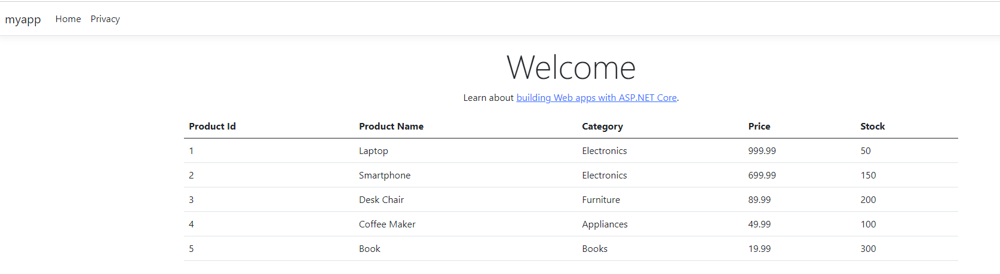

---
lab:
  title: Configure a identidade gerenciada para o Banco de Dados SQL do Azure
  module: Explore Azure SQL Database safety practices for development
---

# Configure a identidade gerenciada para o Banco de Dados SQL do Azure

Neste exercício, você adicionará uma identidade gerenciada ao aplicativo Web de amostra sem armazenar credenciais no código.

O Serviço de Aplicativo do Azure oferece uma solução de hospedagem na Web altamente escalonável e autossustentável. Um de seus principais recursos é o fornecimento de uma identidade gerenciada para seu aplicativo, o que simplifica a segurança do acesso ao Banco de Dados SQL do Azure e a outros serviços do Azure. Ao usar identidades gerenciadas, você pode melhorar a segurança do seu aplicativo removendo a necessidade de armazenar informações confidenciais, como credenciais, em cadeias de conexão. 

Este exercício deve levar aproximadamente **30** minutos para ser concluído.

## Antes de começar

Antes de começar este exercício, você precisa:

- Uma assinatura do Azure com permissões apropriadas para criar e gerenciar recursos.
- [**Visual Studio Code**](https://code.visualstudio.com/download?azure-portal=true) instalado no seu computador com a seguinte extensão instalada:
    - [Serviço de Aplicativo do Azure](https://marketplace.visualstudio.com/items?itemName=ms-azuretools.vscode-azureappservice?azure-portal=true).

## Criar um aplicativo Web e um banco de dados SQL no Azure

Primeiro, criaremos um aplicativo Web e um banco de dados SQL do Azure.

1. Entre no [portal do Azure](https://portal.azure.com?azure-portal=true).
1. Procure por **Assinaturas** e selecione-o.
1. Navegue até **Provedores de recursos** em **Configurações**, procure o provedor **Microsoft.Sql** e selecione **Registrar**.
1. De volta à página principal do portal Azure, selecione **Criar um recurso**.
1. Pesquise por **Aplicativo Web + Banco de dados** e selecione-o.
1. Selecione **Criar** e preencha os detalhes necessários:

    | Grupo | Configuração | Valor |
    | --- | --- | --- |
    | **Detalhes do projeto** | **Assinatura** | Selecione sua assinatura do Azure. |
    | **Detalhes do projeto** | **Grupo de recursos** | Selecionar ou criar um grupo de recursos |
    | **Detalhes do projeto** | **Região** | Selecione a região onde você deseja hospedar seu aplicativo Web |
    | **Detalhes do aplicativo Web** | **Nome** | Insira um nome exclusivo para o aplicativo Web |
    | **Detalhes do aplicativo Web** | **Pilha de runtime** | .NET 8 (LTS) |
    | **Backup de banco de dados** | **Mecanismo** | SQLAzure |
    | **Backup de banco de dados** | **Nome do servidor** | Digite um nome exclusivo para o seu servidor SQL |
    | **Backup de banco de dados** | **Nome do banco de dados** | Digite um nome exclusivo para o seu banco de dados |
    | **Hosting** | **Plano de hospedagem** | Basic |

    > **Observação:** para cargas de trabalho de produção, selecione **Padrão - Aplicativos de produção de uso geral**. O nome de usuário e a senha do novo banco de dados são gerados automaticamente. Para recuperar esses valores após a implantação, vá para a página **Cadeia de conexão** localizada em **Variáveis de ambiente** do seu aplicativo. 

1. Selecione **Examinar + criar** e depois **Criar**. Pode levar alguns minutos para que a implantação seja concluída.
1. Conecte-se ao seu banco de dados no Azure Data Studio e execute o seguinte código.

    ```sql
    CREATE TABLE Products (
        ProductID INT PRIMARY KEY,
        ProductName NVARCHAR(100),
        Category NVARCHAR(50),
        Price DECIMAL(10, 2),
        Stock INT
    );
    
    INSERT INTO Products (ProductID, ProductName, Category, Price, Stock) VALUES
    (1, 'Laptop', 'Electronics', 999.99, 50),
    (2, 'Smartphone', 'Electronics', 699.99, 150),
    (3, 'Desk Chair', 'Furniture', 89.99, 200),
    (4, 'Coffee Maker', 'Appliances', 49.99, 100),
    (5, 'Book', 'Books', 19.99, 300);
    ```

## Adicionar conta como administrador do SQL

Em seguida, você adicionará o acesso da sua conta ao banco de dados. Isso é necessário porque apenas contas autenticadas através do Microsoft Entra podem criar outros usuários do Microsoft Entra ID, que são um pré-requisito para as etapas subsequentes deste exercício.

1. Navegue até o servidor SQL do Azure que você criou anteriormente.
1. No menu **Configurações** à esquerda, selecione **Microsoft Entra ID**.
1. Selecione **Definir administrador**.
1. Procure sua conta e selecione-a.
1. Selecione **Salvar**.

## Habilitar a identidade gerenciada

Em seguida, você habilitará a identidade gerenciada atribuída pelo sistema para seu aplicativo Web do Azure, que é uma prática recomendada de segurança que permite o gerenciamento automatizado de credenciais.

1. Navegue até o seu aplicativo Web no portal do Azure.
1. No **Configurações** no menu à esquerda, selecione **Identidade**.
1. Na guia **Sistema atribuído**, mude o **Status** para **Habilitado** e selecione **Salvar**. Caso você receba uma mensagem perguntando se deseja habilitar a identidade gerenciada atribuída pelo sistema para seu aplicativo Web, selecione **Sim**.

## Permitir acesso a um Banco de Dados SQL do Azure

1. Conectar-se a um Banco de Dados SQL do Azure usando o Azure Data Studio Selecione **Microsoft Entra ID - Universal com suporte a MFA** e forneça seu nome de usuário.
1. Selecione seu banco de dados e abra um novo editor de consultas.
1. Execute os seguintes comandos SQL para criar um usuário para a identidade gerenciada e atribuir as permissões necessárias. Edite o script fornecendo o nome do seu aplicativo Web.

    ```sql
    CREATE USER [your-web-app-name] FROM EXTERNAL PROVIDER;
    ALTER ROLE db_datareader ADD MEMBER [your-web-app-name];
    ALTER ROLE db_datawriter ADD MEMBER [your-web-app-name];
    ```

## Criar um aplicativo Web do 

Em seguida, você criará um aplicativo ASP.NET que usa o Entity Framework Core com o Banco de dados SQL do Azure para exibir uma lista de produtos da tabela de produtos.

### Criar seu projeto

1. No VS Code, crie uma nova pasta. Nomeie a pasta como seu projeto.
1. Abra o terminal e execute o seguinte comando para criar seu novo projeto MVC.
    
    ```dos
        dotnet new mvc
    ```
    Isso criará um novo projeto MVC ASP.NET na pasta que você escolheu e o carregará no Visual Studio Code.

1. Execute o seguinte comando para executar seu aplicativo. 

    ```dos
    dotnet run
    ```
1. O terminal dá a seguinte saída *Agora ouvindo em: http://localhost:<port>*. Navegue até a URL no seu navegador da web para acessar o aplicativo. 

1. Feche o navegador da web e pare o aplicativo. Alternativamente, você pode parar o aplicativo pressionando `Ctrl+C` no terminal VS Code.

### Atualizar seu projeto para se conectar ao Banco de Dados SQL do Azure

Em seguida, você atualizará algumas configurações que permitirão que você se conecte com êxito ao banco de dados SQL do Azure usando a identidade gerenciada.

1. Em seu projeto, adicione os pacotes NuGet necessários para o SQL Server.
    ```dos
    dotnet add package Microsoft.EntityFrameworkCore.SqlServer
    ```
1. Na pasta raiz do seu projeto, abra o arquivo **appsettings.json** e insira a seção `ConnectionStrings`. Aqui, você substituirá `<server-name>` e `<db-name>` pelos nomes reais do seu servidor e banco de dados. Essa cadeia de conexão é usada pelo construtor padrão no arquivo para estabelecer uma conexão com o banco de dados `Models/MyDbContext.cs`.

    ```json
    {
      "Logging": {
        "LogLevel": {
          "Default": "Information",
          "Microsoft.AspNetCore": "Warning"
        }
      },
      "AllowedHosts": "*",
      "ConnectionStrings": {
        "DefaultConnection": "Server=<server-name>.database.windows.net,1433;Initial Catalog=<db-name>;Authentication=Active Directory Default;"
      }
    }
    ```
1. Salve e feche o arquivo.

### Adicionar seu código

1. Na pasta **Modelos** do seu projeto, crie um arquivo **Product.cs** para sua entidade de produto com o seguinte código. Substitua `<app name>` pelo nome real do seu aplicativo.

    ```csharp
    namespace <app name>.Models;
    
    public class Product
    {
        public int ProductId { get; set; }
        public string ProductName { get; set; }
        public string Category { get; set; }
        public decimal Price { get; set; }
        public int Stock { get; set; }
    }
    ```
1. Crie a pasta **Banco de Dados** na pasta raiz do seu projeto.
1. Na pasta **Banco de Dados** do seu projeto, crie um arquivo **MyDbContext.cs** para a entidade do seu produto com o seguinte código. Substitua `<app name>` pelo nome real do seu aplicativo.

    ```csharp
    using <app name>.Models;
    
    namespace <app name>.Database;
    
    using Microsoft.EntityFrameworkCore;
    
    public class MyDbContext : DbContext
    {
        public MyDbContext(DbContextOptions<MyDbContext> options) : base(options)
        {
        }
    
        public DbSet<Product> Products { get; set; }
    }    
    ```
1. Na pasta **Controladores** do seu projeto, edite as classes `HomeController` e `IActionResult` para o arquivo **HomeController.cs** e adicione a variável `_context` com o seguinte código.

    ```csharp
    private MyDbContext _context;

    public HomeController(ILogger<HomeController> logger, MyDbContext context)
    {
        _logger = logger;
        _context = context;
    }

    public IActionResult Index()
    {
        var data = _context.Products.ToList();
        return View(data);
    }
    ```
1. Na pasta **Visualizações -> Início** do seu projeto, atualize o arquivo **Index.cshtml** e adicione o seguinte código.

    ```html
    <table class="table">
        <thead>
            <tr>
                <th>Product Id</th>
                <th>Product Name</th>
                <th>Category</th>
                <th>Price</th>
                <th>Stock</th>
            </tr>
        </thead>
        <tbody>
            @foreach(var item in Model)
            {
                <tr>
                    <td>@item.ProductId</td>
                    <td>@item.ProductName</td>
                    <td>@item.Category</td>
                    <td>@item.Price</td>
                    <td>@item.Stock</td>
                </tr>
            }
        </tbody>
    </table>
    ```

1. Edite o arquivo **Program.cs** e insira o trecho de código fornecido logo acima da linha `var app = builder.Build();`. Essa alteração garante que o código seja executado durante a sequência de inicialização do aplicativo. Substitua `<app name>` pelo nome real do seu aplicativo.

    ```csharp
    using Microsoft.EntityFrameworkCore;
    using <app name>.Database;

    var builder = WebApplication.CreateBuilder(args);

    // Add services to the container.
    builder.Services.AddControllersWithViews();
    builder.Services.AddDbContext<MyDbContext>(options =>
        options.UseSqlServer(builder.Configuration.GetConnectionString("DefaultConnection")));
    ```

    > **Observação:** se você quiser executar seu aplicativo antes da implantação, atualize a cadeia de conexão com as credenciais de usuário do SQL. O nome de usuário e a senha do novo banco de dados foram gerados automaticamente. Para recuperar esses valores após a implantação, vá para a página **Cadeia de conexão** localizada em **Variáveis de ambiente** do seu aplicativo. Depois de confirmar que o aplicativo está sendo executado conforme o esperado, volte a usar a identidade gerenciada para um processo de implantação seguro.

### Implantar o código

1. Abra a **paleta de comandos** pressionando `Ctrl+Shift+P`.
1. Digite **Serviço de Aplicativo do Azure: Implantar no Aplicativo Web...** e selecione-o.
1. Selecione a pasta que contém o código do seu aplicativo Web.
1. Escolha o aplicativo Web que você criou na etapa anterior.
    > Observação: Você pode receber uma mensagem: "A configuração necessária para implantar está faltando em "seu aplicativo". Selecione **Adicionar configuração**. Em seguida, siga as instruções e selecione sua assinatura e o recurso de serviço do aplicativo.
1. Confirme a implantação quando solicitado.

## Teste seu aplicativo

Execute seu aplicativo Web e verifique se ele pode se conectar ao Banco de Dados SQL do Azure sem nenhuma credencial armazenada.

1. Abra um navegador e navegue até a URL do seu Aplicativo Web do Azure (por exemplo, https://your-web-app-name.azurewebsites.net).
1. Verifique se o aplicativo Web está em execução e acessível.
1. Você deve ver uma página da web como abaixo.

    

## Configurar implantação contínua (Opcional)

1. Abra a **paleta de comandos** pressionando `Ctrl+Shift+P`.
1. Digite **Serviço de Aplicativo do Azure: Configurar Entrega Contínua...** e selecione-o.
1. Siga as instruções para configurar a implantação contínua a partir do seu repositório GitHub ou Azure DevOps.

Considere os cenários em que seria benéfico usar **Identidade gerenciada atribuída pelo usuário** em vez de **Identidade gerenciada atribuída pelo sistema**.

## Limpar

Quando você está trabalhando em sua própria assinatura, é uma boa ideia identificar, no final de um projeto, se você ainda precisa dos recursos criados. 

Deixar os recursos funcionando desnecessariamente pode resultar em custos extras. É possível excluir os recursos individualmente ou excluir todo o conjunto de recursos no [portal do Azure](https://portal.azure.com?azure-portal=true).

## Mais informações

Para obter mais informações sobre grupos de failover automático para o Banco de dados SQL do Azure, consulte [Identidades gerenciadas no Microsoft Entra para SQL do Azure](https://learn.microsoft.com/azure/azure-sql/database/authentication-azure-ad-user-assigned-managed-identity?azure-portal=true).
